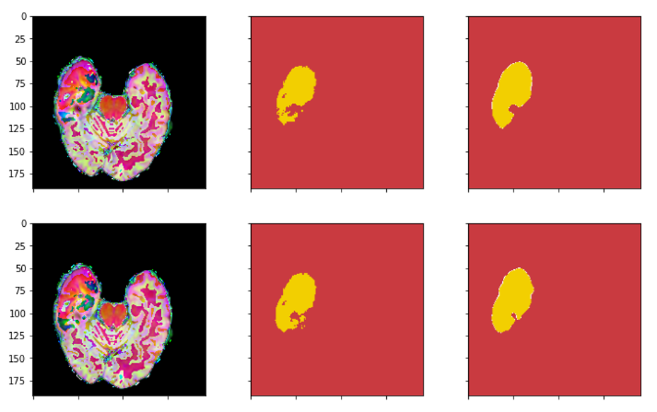
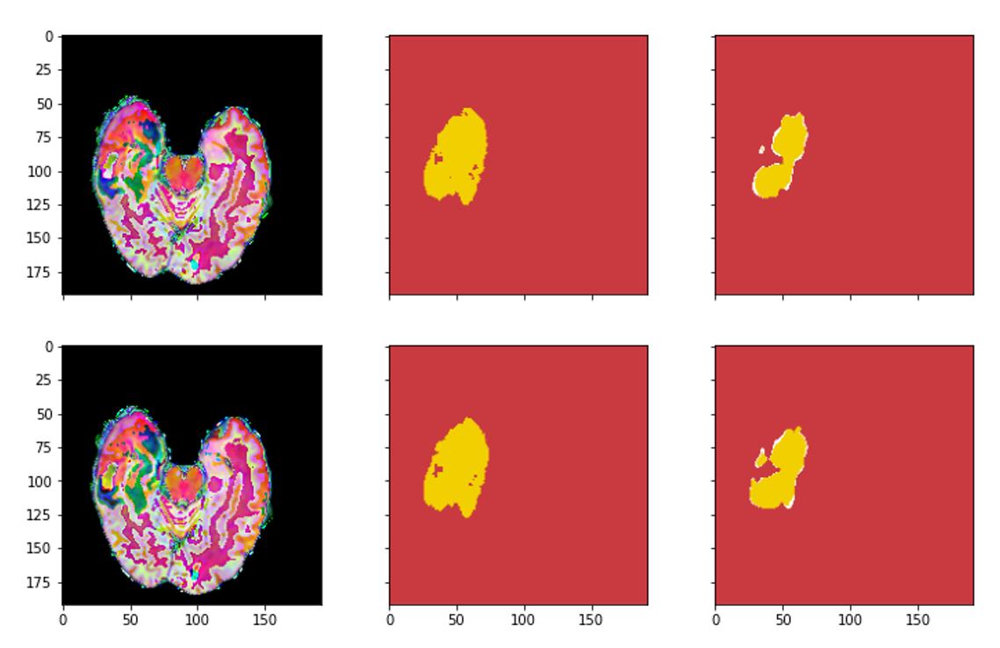

# Brain-tumor-segmatation-BraTs
This was the final project for a course ,"Deep Learning" 2021, at National Chung-Hsing University, Taiwan. The objective of the project was to detect brain tumors using the Unet architecture, and the BraTs 2015 dataset was utilized for this purpose.

# Usage

## Dataset
The [BraTs 2015](https://www.kaggle.com/datasets/andrewmvd/brain-tumor-segmentation-in-mri-brats-2015) dataset is used in this project.

## The following packages are required:

- SimpleITK
- tqdm
- numpy
- matpoltlib
- torch
- torchvision
- PIL
- Keras
- cv2

## Data Pre-processing
1. **Resized the image**

    Data  format(types x height x width x slices): 
    4 x 240 x 240 x 155 -> 4 x 192 x 192 x 90 

2. **Transfered data type**
    .mha to .npy

3. **Image Smoothing**

    Applied image smoothing to dataset

4. **Label Pre-processing**

    Used One-hot encoding

## Model

Implemented Unet [[Original paper](https://arxiv.org/abs/1505.04597)]

## Result

The images in the middle is the actual position of the tumors, the images in the right in the prediction of our model.

  

  

# Credits
This project was cooperated by [Jamie/ Chieh-Ying](
https://github.com/jamie870116) and [Kevin/ Ping-Sung](https://github.com/Ping-Sung).

Please feel free to contect [me](jamie870116@gmail.com) for any further questions.

# License
This project is licensed under the [MIT License](https://opensource.org/licenses/MIT).

